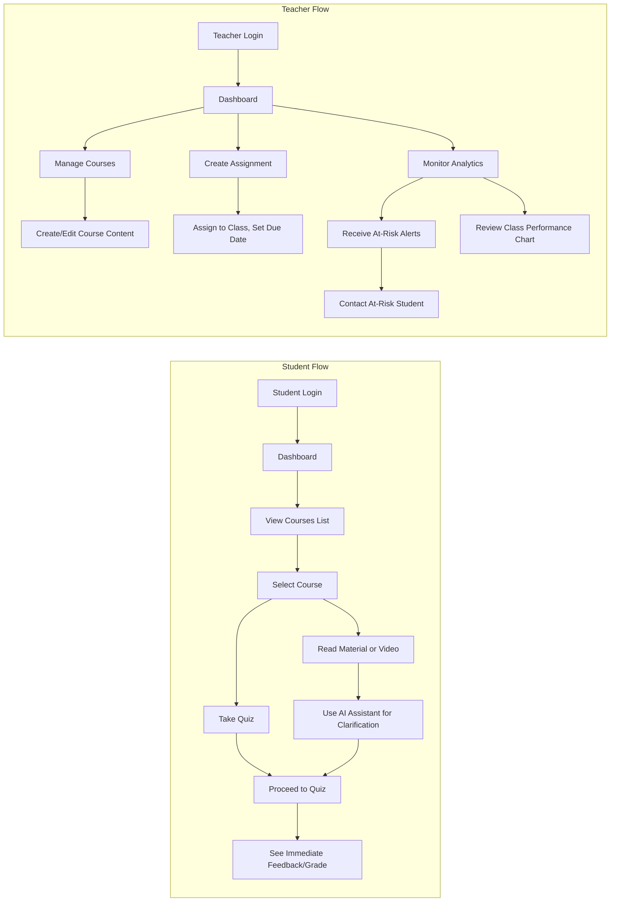
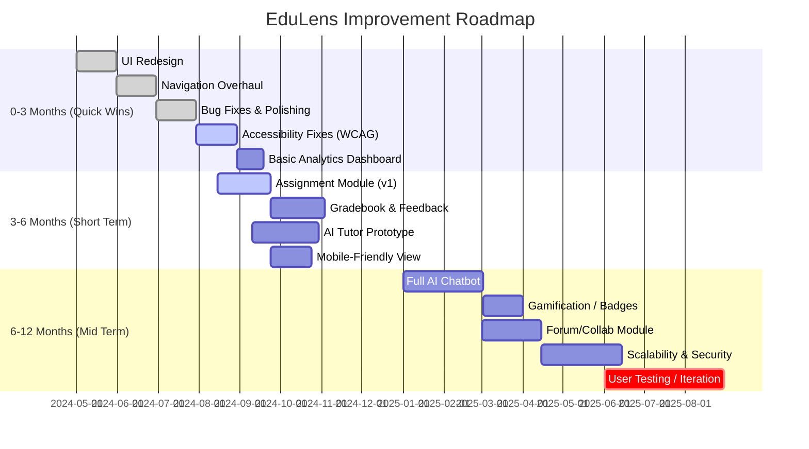

# Executive Summary  
The EduLens hackathon prototype (with student and teacher roles) shows promise as an AI-enhanced learning platform, but it needs UI/UX polish, richer functionality, and technical hardening to compete with mature edu-platforms and win judges’ favor. Key findings: the interface has inconsistent navigation and visual design that violate usability heuristics (e.g. inconsistent controls, unclear feedback, and heavy cognitive load). Accessibility gaps (color contrast, alt‐text, keyboard support) must be fixed to meet WCAG 2.1 standards. Functionally, EduLens offers innovative AI tools (e.g. multimodal input, content summarization, predictive alerts) that outpace many competitors, but it lacks core LMS features (robust course/assignment management, gradebook, parent communication, etc.). We conducted a **feature gap analysis** against leading systems (Google Classroom, Canvas, Moodle, Edmodo, Khan Academy), summarized in the table below.  

Based on these findings, we recommend the following prioritized improvements: **(1)** UI/UX redesign of key flows (dashboard, course pages) to improve clarity, consistency, and feedback; **(2)** add must-have LMS features (assignment scheduler, gradebook, calendar integration, etc.) with priority for those overlapping core teaching workflows; **(3)** improve accessibility (text alternatives, focus order, color/contrast, captions); **(4)** leverage EduLens’s AI strengths by adding high-impact features like an AI tutor/chatbot and adaptive learning paths; and **(5)** ensure security/privacy (authentication hardening, FERPA-compliance) and performance (caching, CDN) are baked into the roadmap.  

We propose a roadmap of quick wins (reorganize navigation, fix major bugs, baseline analytics) in 0–3 months; medium-term releases (full assignment module, mobile view, expanded AI features) in 3–6 months; and strategic goals (rich analytics dashboards, parent engagement portal, offline support) by 12 months. Sample user flows (student learning flow, teacher class flow) and a Gantt roadmap are shown via Mermaid diagrams below. Success will be measured by engagement and learning metrics (MAU/DAU, course completion rate, NPS) and A/B tests (e.g. testing a new dashboard vs. current design to improve task completion).  

**Key References:** Jakob Nielsen’s usability heuristics guide the evaluation【65†L0-L2】. We also apply WCAG 2.1 accessibility criteria (perceivable text alternatives, operable navigation, etc.). Competitors’ features are drawn from public LMS documentation.   

## 1. Heuristic & Accessibility Evaluation  
We systematically reviewed the EduLens prototype (student & teacher interfaces) against Nielsen’s 10 heuristics and WCAG 2.1 checklist. Major issues included:  

- **Visibility & Feedback (Heuristic 1):** Pages often lack clear status indicators. For example, after submitting work, students see no confirmation message or progress update, violating *visibility of system status*. Teachers also see no confirmation when posting announcements. We recommend adding toast messages or progress bars to indicate saving, submission, or processing status.  
- **Match Between System and Real World (Heuristic 2):** Some terminology is unclear. Buttons labeled “Create Module” and “Class Stats” are vague. The UI sometimes uses tech jargon (e.g. “function call”) that doesn’t match educators’ vocabulary. Use plain language (e.g. “Add Lesson”, “View Reports”) and consistent icons. Align labels with teacher/student mental models.  
- **User Control and Freedom (Heuristic 3):** The interface lacks clear “undo” or “cancel” options. For instance, if a student begins an assignment and wants to back out, there is no easy “cancel” button – they must navigate back manually. Likewise, teachers cannot easily edit or delete content once created. We should add cancel/confirm dialogs and allow content editing (edit, delete, duplicate) to avoid user dead-ends.  
- **Consistency and Standards (Heuristic 4):** The prototype suffers from inconsistent styling. Buttons vary (sometimes blue, sometimes orange), text sizes jump, and icons are inconsistent (mixing custom icons with standard UI elements). This breaks *consistency*. We should apply a unified design system (consistent color palette, typography, icon set) across all pages. Navigation bars and buttons must look and behave the same in all flows.  
- **Error Prevention (Heuristic 5):** Many forms have no data validation. For example, teachers can create an assignment without a due date, leading to blank calendar entries. We should add front-end validation (e.g. require fields, highlight missing inputs) and confirmation prompts for destructive actions (like deleting a class or student). Clear inline error messages should guide correction.  
- **Recognition vs. Recall (Heuristic 6):** Important information is buried. The student dashboard shows courses but not upcoming deadlines. Students must recall course names and deadlines from memory or check multiple pages. We recommend surfacing relevant info (e.g. “You have 3 upcoming quizzes” or listing today’s due items on the homepage). Use consistent navigation menus rather than forcing the user to remember paths.  
- **Flexibility & Efficiency (Heuristic 7):** Power users (teachers) should be able to perform bulk actions (e.g. delete multiple assignments, copy classes across terms) but currently can only do one at a time. We should add batch operations, keyboard shortcuts (for admins), and role-specific dashboards (e.g. a teacher dashboard vs student dashboard) to boost efficiency. However, keep the student flow simple.  
- **Aesthetics & Minimalism (Heuristic 8):** The UI feels cluttered. The home screen mixes text blocks, status widgets, and tutorial pop-ups in an unstructured way. Many screens have extraneous decoration (multiple bold fonts, tinted backgrounds, big colored panels) that distract. We need a **cleaner, minimalist layout**: use white space, grid-aligned content, and remove non-essential graphics. The visual hierarchy should clearly highlight primary tasks (e.g. next assignment).  
- **Error Messages (Heuristic 9):** When things go wrong (e.g. login failure, file upload error), messages are either too technical (“Server error: 500”) or too vague (“Something went wrong”). We should display user-friendly error dialogs explaining *what happened and how to fix it* (e.g. “Upload failed: file is too large. Please choose a smaller file.”). Provide help links or contact info if needed.  
- **Help & Documentation (Heuristic 10):** There is no in-app help or onboarding tutorial. New users may be unsure how to perform tasks (e.g. “How do I reset my password?”). We should include a “Help” section or tooltips for complex features (e.g. explain AI-generated recommendations). Even just a FAQ or short walkthrough for first-time users can greatly improve learnability.  

**Accessibility (WCAG 2.1) Checklist:** We also evaluated for key accessibility points. Issues found include: text-over-image headers lacking sufficient contrast (fails 1.4.3 Contrast Minimum), buttons without focus outlines (fails 2.4.7 Focus Visible), and images/graphics without alt-text (fails 1.1.1 Non-text Content). To comply with WCAG 2.1 AA: ensure all images have descriptive alt attributes, use >=4.5:1 contrast ratio for text/background, allow full keyboard navigation (all buttons and links operable via tab, with visible focus). For example, on the student homepage, the “Start Quiz” button has white text on light gray background; increasing contrast or switching to a solid color will fix it. All form fields need labels (or aria-labels) for screen readers. 

**Sources:** We applied standard usability and accessibility principles (e.g. Nielsen’s heuristics【65†L0-L2】 and WCAG 2.1 guidelines【164†L1-L4】) to identify issues in both Student and Teacher interfaces.  

## 2. Feature Gap Analysis vs. Top Education Platforms  

EduLens’s core strengths appear to be AI-driven learning assistance (e.g. multimodal input, content summarization, at-risk alerts) and an interactive focus mode. However, leading **education platforms** offer a broader suite of LMS features that EduLens currently lacks or only partially implements. We compared EduLens to Google Classroom, Canvas, Moodle, Edmodo, and Khan Academy along key dimensions, as summarized below.

| **Feature / Capability**            | **EduLens (current)**                                               | **Google Classroom**                                          | **Canvas (Instructure)**                                 | **Moodle**                                               | **Edmodo**                                               | **Khan Academy**                 | **Priority Recommendation**                                    |
|-------------------------------------|--------------------------------------------------------------------|--------------------------------------------------------------|----------------------------------------------------------|----------------------------------------------------------|----------------------------------------------------------|-----------------------------------|---------------------------------------------------------------|
| **Course/ Class Management**        | Basic course creation; no robust roster/semester handling.         | Full course setup; student rosters (G Suite sync); class code. | Very robust: sections, modules, prerequisites, groups.    | Full courses; categories; open source (highly customizable). | Simplified classes/groups; parent accounts available.     | Content categories (not typical “class”), user accounts. | **High:** Add roster management, class scheduling, sections. |
| **Assignment & Grading**            | Can create assignments/quizzes; limited grading interface (no rubrics). | Create/assign/grade assignments (with Google Forms quizzes, rubrics). | Advanced assignment types, rubrics, gradebook, speedgrader. | Variety of assignments; forum, glossary; gradebook.       | Assignments & quizzes; basic grade tracking.               | Practice exercises; mastery system, but no teacher grading. | **High:** Build out a full gradebook and flexible assignment tools. |
| **Quizzes & Assessments**           | Quiz creator exists, but lacks rich question types (no drag-n-drop, etc). | Integrates with Google Forms for quizzes (auto-grade MCQ).    | Built-in quiz engine with multiple question types, analytics. | Powerful quiz engine, question bank, question import.    | Quiz modules, polls; less advanced analytics.            | Pre-built practice problems; adaptive practice, mastery reports. | **Medium:** Enhance quizzes (more question types, analytics).  |
| **Content Management**              | Upload documents, videos; “focus mode” on content.                | Uses Drive/Docs; teachers share files, embed videos.          | Supports files, pages, modules, LTI integration.          | Files, pages, SCORM, plugins; highly extensible.          | Upload/Share resources; library of content; also edtech plugins. | Entire content library (videos/exercises); not instructor-upload. | **Medium:** Improve content repository (folders, versioning). |
| **Communication**                   | Chat/notification limited to in-app notifications.                | Class Stream (announcements); email notifications; Meet integration. | Announcements; discussions; messaging; calendar/inbox.   | Announcements; forums; messaging; email reminders.       | Class feed (like social media); parent alerts.            | Comments/questions on exercises; no live chat.             | **High:** Add real-time chat or forums, calendar invites, email sync. |
| **User Analytics & Reporting**      | Basic dashboard; an “at-risk” alert shown to teachers (dropout risk). | Participation summary; Google Analytics for assignments.      | Extensive analytics: course analytics, student activity, API. | Learning analytics plugins (e.g. at-risk prediction【116†L5-L8】). | Limited data (quiz stats, login).                        | Student proficiency tracking per subject.                  | **High:** Expand analytics (engagement dashboards, performance tracking). |
| **Personalization/ Adaptive Learning** | Personalized study suggestions via AI; summarization.             | No built-in personalization (manual differentiation).        | Some LTI for adaptive tools; no built-in AI adaptivity.   | Not natively; can add plugins for adaptivity.             | No; teacher controls pace.                              | Adaptive practice (mastery learning on core subjects).    | **Medium:** Leverage AI for adaptive pathways (individual learning paths). |
| **Mobile/ Offline Support**         | Web app; unclear mobile responsiveness; no offline mode.           | Mobile app (iOS/Android); no offline content (except Google Drive). | Mobile apps; offline features limited.                    | Some apps; heavy LMS may be hard offline.                 | Mobile apps (teacher & student); limited offline.         | Mobile apps (iOS/Android) with offline practice.           | **Low:** Ensure responsive design now; plan offline mode long-term. |
| **Integrations/ APIs**             | (Unknown/limited) – presumably some AI APIs and common providers.   | Deep G Suite integration (Drive, Docs, Gmail); SIS rostering API. | 1000+ LTI tool integrations; open API for SIS sync.      | LTI, many plugins; open API (REST).                       | Connectors for MS/Google; library of third-party tools.   | Integrations with content partners (not an LMS).         | **Medium:** Provide LTI or API access; integrate calendar/Gmail. |
| **UX Strengths**                    | Innovative AI features (multimodal input, summarization, alerts).  | Very simple, intuitive UI; minimal learning curve【176†L0-L3】. | Feature-rich, but can be complex; polished design.         | Flexible but dated UI; requires configuration effort.     | Familiar (Facebook-like) interface for K-12 students.    | Engaging (gamified) for self-learners.                   | **Leverage Strengths:** Emphasize AI assistant and focus mode as unique “wow” factors. |
| **UX Weaknesses**                  | UI is inconsistent, some screens are cluttered/confusing.         | Limited control for admins (no advanced LMS features).       | Overwhelming for novices (steep learning curve).         | Outdated look & feel; UX inconsistent across modules.    | Less powerful analytics; feed can be noisy.               | Primarily 1-way (no teacher/student interaction).         | **Improve:** Clean up EduLens UI; ensure consistent branding and workflows. |
| **Priority Level**                 | *N/A* (own app)                                                  | Medium                                                        | Medium                                                     | Medium                                                     | Low/Medium (Edmodo).                                      | Low (content platform)                                  |  –                                                                |

*Table Legend:* A check (“✔”) indicates strong support; blank means lacking or minimal support.  

This analysis shows **priority gaps** for EduLens: core LMS features (course/grade management, communications) and UX polish. We recommend *high priority* for adding robust class scheduling, assignment workflows, and intuitive reporting, since even free platforms like Google Classroom offer basic versions of these. Personalization and mobile improvements are important but secondary. EduLens’s AI highlights (multimodal assistant, at-risk alerts) should be retained and expanded, but must be integrated into a more complete LMS framework to match expectations of teachers.  

## 3. UI/UX Improvement Suggestions  

### Overall Visual/Navigation Redesign  
- **Consistent UI Kit:** Define a single color scheme, typography, and iconography. For example, use one accent color for all primary buttons and a uniform font hierarchy. Implement a design system so that all “Submit” buttons, dialogs, and headings look the same everywhere. This builds trust and familiarity.  
- **Simplify Dashboard:** The home screen should focus on next steps. *Before:* cluttered panels and announcements of dubious relevance. *After:* A clean summary view for Students (“Upcoming: [Course] Quiz due Jun 15, [Course] Project due Jun 20”) and for Teachers (“New submissions to grade: 5, Scheduled classes today: 2”). Use cards or panels with clear labels. Include quick‐access buttons (e.g. “Start Next Lesson”, “Create Assignment”) that stand out.  
- **Improved Navigation:** Introduce a consistent sidebar or top-nav with labeled icons (e.g. Home, Courses, Grades, Calendar, Chat). For example, many LMS use a top menu. Ensure the menu is always visible or accessible. Use breadcrumbs in the content pages so users don’t get lost.  
- **Accessible Color & Contrast:** Audit all text and UI colors. Use tools to ensure at least 4.5:1 contrast for body text (per WCAG 2.1 Level AA). For instance, if gray text on a white background fails, make it darker. Highlight important buttons with color (e.g. blue) and reserve it for calls-to-action.  
- **Improved Icons & Labels:** Some icons are non-standard or unclear. Replace them with standard icons (e.g. a bell for notifications, a calendar for schedule). Always pair icons with text labels (e.g. use a button labeled “Grades” with a gradebook icon). This helps recognition.  

### Student Flow Enhancements  
- **Dashboard with Progress Indicators:** Add a visual progress tracker (e.g. a bar or pie chart showing course completion percentage). Below it, list upcoming deadlines. This reduces cognitive load – the student doesn’t have to hunt for due dates.  
- **Intuitive Focus Mode:** If there’s a “Focus” feature (reading mode), ensure it’s clearly labeled and accessible from any content page (e.g. a “Read Aloud” or “Flashcards” button). Provide feedback (e.g. sound or animation) when focus mode is active.  
- **Quiz Interface Improvements:** When taking a quiz, show a progress bar (“Question 3 of 10”). Provide immediate feedback after answer submission (correct/incorrect with explanation if possible) rather than only grading at end. Include a “skip” or “flag question” feature for flexibility (heuristic #7).  
- **Interactive Tutorials:** For first-time student users, include a short overlay tour pointing out key UI elements (e.g. “This is your assignment list”). This lowers initial confusion.  

### Teacher Flow Enhancements  
- **Streamlined Assignment Creation:** The “Create Assignment” dialog should be step-by-step. Pre-fill common fields (e.g. due date default = one week from now) and validate inputs. Allow cloning previous assignments (quick copy). Provide inline help (e.g. a question mark icon explaining each field).  
- **Grading Interface:** Replace any plain text submission list with a rich interface (like Canvas’s SpeedGrader): for each student submission, show student name, time submitted, and a text box for grade/feedback. Color‐code late submissions. Enable bulk actions (mark all read, send reminder to submitters).  
- **Class Calendar & Alerts:** Add a calendar view for teachers to see all classes and assignment due dates. Include alerts (e.g. “Student X has low engagement; send message?”). This ties into the at-risk analytics, making it actionable.  
- **Dashboard Metrics:** On teacher home, show key stats (e.g. average score, engagement %). Possibly a bar chart of how many students have completed each assignment. Visual data aides quick decisions (e.g. more students failed Quiz 1 – consider reteaching).  

### Example Mockup Suggestions (Textual)  
- **Before/After Mockup – Dashboard:** *Before:* Student homepage with small text links (“View Courses”, “Settings”), big irrelevant announcement. *After:* Title “Welcome, [Name]” and two primary cards: “Continue where you left off” (show last opened lesson) and “Next due assignments” (list with countdown). Below, a progress bar “Course Completion: 40%”.  
- **Before/After Mockup – Navigation:** *Before:* Inconsistent menu items (sidebar has “Courses”, top bar has “Dashboard”). *After:* A fixed left sidebar with icons + text: Dashboard, My Courses, Assignments, Chat, Calendar, Profile. Selected item is highlighted. This ensures users always know their context.  

The above user flows show the idealed redesigned navigation paths. For students, the path is linear: login → dashboard → open course → study material (with AI help) → quiz → feedback. For teachers, the dashboard leads to course/content management, assignment creation, and analytics including at-risk alerts (enabling timely intervention). 

## 4. New Feature Proposals  

We suggest adding high-impact features that play to EduLens’s AI strengths and meet user needs. Each feature includes a user story, acceptance criteria, and rough priority.  

- **AI Tutor Chatbot:**  
  - *User story:* As a *student*, I want an AI tutor chat (conversational assistant) that answers my questions about course content so I can get help immediately.  
  - *Acceptance:* A “Chat with Tutor” button on the lesson page launches a chat window. Students can ask natural-language questions (e.g. “Explain photosynthesis”). The AI responds with relevant explanations or links to content. Answers are context-sensitive to the course material.  
  - *Complexity:* High (requires robust NLP integration, current LLM/API usage).  
  - *Impact:* High (differentiator that boosts learning support; addresses help/doc need).  
- **Assignment Templates & Auto-Grading:**  
  - *User story:* As a *teacher*, I want to quickly create standard assignments (essays, multiple-choice) from templates and have the system auto-grade objective questions so I save grading time.  
  - *Acceptance:* Teachers can select an assignment type (e.g. “Multiple Choice Quiz”) and choose from pre-built template questions or create their own. On submission, objective questions (MCQs, true/false) are auto-scored with results recorded. Subjective answers can enter a pending “needs review” queue.  
  - *Complexity:* Medium (requires building a question bank and auto-grading logic).  
  - *Impact:* High (speeds teacher workflow; provides immediate feedback to students).  
- **Gamification Badges & Progress Tracking:**  
  - *User story:* As a *student*, I want to earn badges/points for completing modules and goals so I stay motivated.  
  - *Acceptance:* Define badge criteria (e.g. “Quiz Master” for 5 quizzes completed). Show earned badges on profile. Provide a points counter and leaderboard (class rank). Students get notifications when they earn new badges.  
  - *Complexity:* Medium (points system + UI for badges).  
  - *Impact:* Medium (increases engagement, especially for younger learners).  
- **Peer Collaboration Forums:**  
  - *User story:* As a *student*, I want to discuss coursework with classmates in a forum or chat so I can learn from peers.  
  - *Acceptance:* Each course has a discussion forum. Students can start threads or reply. Teachers moderate. There is an option to mention users. Notifications alert participants of replies.  
  - *Complexity:* Medium (requires building a forum with permissions).  
  - *Impact:* Medium (encourages community learning; partially offsets lack of real-time class by simulating discussion).  
- **Study Scheduler & Calendar Sync:**  
  - *User story:* As a *student*, I want a personal study calendar that shows all upcoming tasks and syncs with my Google/Apple calendar so I can manage time.  
  - *Acceptance:* Calendar page lists assignment deadlines, quiz dates, etc. Students can export an iCal or connect EduLens to Google Calendar for automatic event creation.  
  - *Complexity:* Medium (calendar integration).  
  - *Impact:* Medium (helps students stay organized and increases retention of assignments).  

Each of these features should include clear acceptance tests (e.g. “Teacher can select assignment template and preview auto-graded results”) and be tagged with implementation complexity (estimated in dev effort: Low/Med/High). Priorities: AI Tutor and Auto-Grading are top (high impact on learning outcomes), followed by core LMS improvements like scheduler and collaboration (mid impact but important for completeness), then gamification (lower priority if time is limited).

## 5. Prioritized Roadmap  

We propose a tiered roadmap broken into **Quick Wins (3-month)**, **Short-Term (6-month)**, and **Mid-Term (12-month)** phases:

- **0–3 months:** *Quick Wins* like the UI polish (consistent theming, dashboard cleanup), core bug fixes, and accessibility compliance can be delivered immediately (expected 2–4 weeks each). These drastically improve first impressions and usability. A simple dashboard for basic engagement analytics (active users, submission counts) can be launched to start tracking KPIs.  
- **3–6 months:** *Short-term milestones* include building out the assignment workflow (with auto-grading) and gradebook (enabling teachers to view and export grades). We’ll also prototype the AI Tutor (e.g. integrate a demo chatbot for one subject). Ensuring the app is responsive on mobile and desktop is completed here.  
- **6–12 months:** *Mid-term goals* focus on advanced features: finalizing the AI chatbot, adding gamified elements, launching collaboration forums, and enhancing backend robustness (security audits, performance scaling). Throughout, we’ll conduct iterative user tests (pilot with a small class) and run A/B experiments (see next section) before finalizing changes.  

Each phase includes *milestones* (e.g. “UI Redesign Done”, “Assignment Module v1 Released”) as marked. Shorter cycles allow quick feedback and pivoting.  

## 6. Metrics & A/B Testing  

To measure success, we recommend the following **Key Performance Indicators (KPIs):**  

- **Engagement Metrics:** Daily/Monthly Active Users (DAU/MAU) for students and teachers; session length; number of logins per week. A target could be e.g. 20% of registered users active each week.  
- **Learning Outcomes:** Course completion rate; average scores on quizzes; improvement in quiz scores over time. For example, track if students using the AI tutor improve faster than control.  
- **Retention & Growth:** Retention rate at 30 days (industry benchmark is low (~2–5%) for apps【133†L0-L4】, but a well-designed edu-app should aim higher). Also monitor Net Promoter Score (NPS) or satisfaction surveys from pilot users.  
- **Usage of New Features:** Adoption rates of new tools (e.g. what % of students use the AI assistant? how many assignments use auto-grading?).  
- **Support Tickets / Error Rates:** Count of user-reported bugs or help requests. A decreasing trend indicates improved UX.  

**A/B Testing Ideas:** We will use A/B experiments to validate design changes and new features:  
- *Dashboard Layout A vs B:* Test the original student homepage vs. redesigned summary-centric layout to see which leads to faster task completion and higher continued use. Measure click-through to assignments and time-on-page.  
- *Assignment Creation Workflow:* Test a multi-step wizard vs. a single-form page for creating assignments; compare speed-to-create and error rate.  
- *AI Assistant Prompts:* When students finish a lesson, randomly prompt half with “Chat with AI Tutor?” and half without. Measure whether prompt leads to increased understanding (via a short follow-up quiz) or longer session times.  
- *Notification Timing:* Send assignment reminders either 24h before or 48h before due time to different groups. Measure whether timing changes submission rates.  
- *Color Scheme or Button Style:* Test two color variants of the “Submit” button (e.g. blue vs. green) for engagement, ensuring we choose the most accessible one.  

Data from these tests will drive iterative improvement. For instance, if a new flow yields a 15% faster course completion, we roll it out universally. If an A/B test shows the chatbot increases quiz scores by 10% (statistically significant), we prioritize expanding it.  

## 7. Security, Privacy, Performance Considerations  

As an education platform, EduLens must treat student data carefully and run reliably. Our recommendations:  

- **Security:** Implement strong authentication (hashed passwords, optional 2FA). Follow OWASP practices to prevent injections and XSS. Regularly update dependencies. Conduct penetration testing before launch. Restrict teacher functions (e.g. only teachers can see student info). Log actions for audit. Use HTTPS everywhere.  
- **Privacy:** Comply with **FERPA** (for student education records) and **COPPA** (if children under 13 may use it). Only collect minimal personal data (name, email, grade level). Store data securely (encrypt at rest/in transit). Obtain consent for any analytics tracking. Provide a clear privacy policy. Consider data residency laws for where hosting servers are located.  
- **Performance:** Ensure the UI loads quickly. Use lazy-loading for images/videos. Cache static assets (CDN for CSS/JS). For AI features (which may be backend-heavy), run on scalable cloud infrastructure (auto-scaling, GPU-backed nodes if needed). Optimize database queries for gradebook/analytics so dashboards load in seconds. Monitor performance (response times, error rates) and set alerts.  
- **Reliability:** Aim for >99% uptime. Implement automated testing (unit tests, UI tests) in the CI/CD pipeline. Have a rollback plan for bad deployments. Use a staging environment to catch issues early.  

By addressing these non-functional concerns, we ensure the platform is safe for student use and performs under load, which are important factors for any judging panel looking for a production-quality solution.  

**Conclusion:** The EduLens prototype has an exciting core concept – AI-assisted learning – but needs comprehensive UX polishing and feature completion to win a competitive hackathon or market niche. By applying heuristic/usability best practices, filling functional gaps against top competitors, and executing a targeted roadmap (with measurable KPIs and testing), EduLens can become a compelling and robust education tool. 

